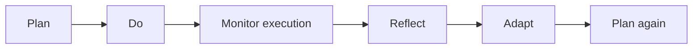
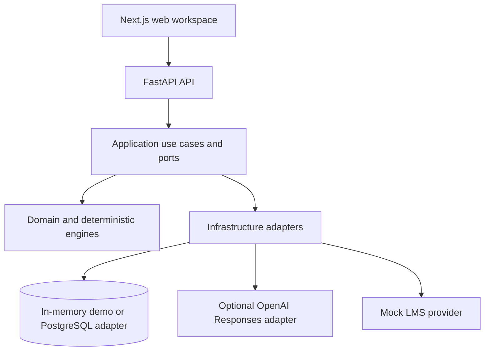
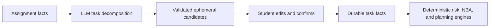
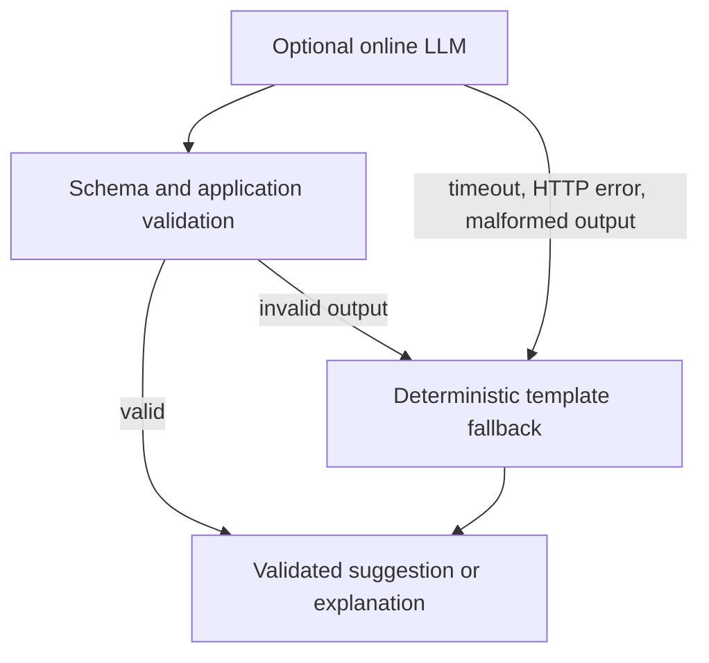

# HaUI Compass — Council Presentation v1

**Audience:** university council.
**Suggested length:** 10–12 minutes, then Q&A.
**Evidence baseline:** commit `b06ee2d`, verified 2026-10-05.
**Status language:** label every implemented item as development-only unless explicitly stated
otherwise.

## Slide 1 — The student’s planning problem

**Key points**

- An LMS tells students what exists: courses, assignments, and deadlines.
- It does not resolve which concrete action best fits the student’s current time and workload.
- Large assignments stay vague until students turn them into manageable steps.
- A plan loses value when real execution differs from its assumptions.

**Visual suggestion:** a simple student journey with fragmented inputs on the left and one clear
next action on the right.

**Speaker notes:** Start with a narrow problem. Do not claim that every student has the same
planning difficulty. State that HaUI Compass explores support for the question, “What should this
student do next, and why?”

**Claim boundary:** problem framing and product direction. No student-outcome improvement claim.

## Slide 2 — What HaUI Compass demonstrates today

**Key points**

- A development-only learning loop combines tasks, deadlines, availability, execution, reflection,
  and plan revisions.
- It presents one explainable Next Best Action rather than an undifferentiated to-do list.
- It keeps risk evidence, planning constraints, and adaptation history visible.
- The council demo uses reproducible, fictional in-memory scenarios.

**Visual suggestion:** a workspace screenshot showing Today, Weekly Plan, and History as three
connected panels.

**Speaker notes:** Use “demonstrates” rather than “solves.” The live system is a technical demo,
not a deployed student service. The main value of the demo is an inspectable learning-loop design.

**Claim boundary:** implemented in the demo. Authentication, a real LMS, and a production service
remain planned.

## Slide 3 — The learning loop

**Key points**

- Planning allocates explicit task effort into explicit study windows.
- Students record what happened rather than allowing the system to infer it silently.
- Reflection creates candidates and requires confirmation before durable use.
- Replanning keeps valid future blocks and explains the changes.

**Visual suggestion:** use the learning-loop Mermaid diagram below. Animate one stage at a time.

**Speaker notes:** Emphasize that actual session duration does not automatically reduce remaining
effort. The student supplies remaining effort during replanning, avoiding an unjustified inference.

**Claim boundary:** the demo implements a bounded version of this loop. Confirmed reflection is
informational for replanning v0 and does not autonomously change placement.

## Slide 4 — Modular-monolith architecture

**Key points**

- The web workspace calls FastAPI HTTP adapters.
- Application use cases orchestrate ports, repositories, and pure engines.
- Domain types and engines stay independent of FastAPI, databases, and model SDKs.
- Infrastructure owns persistence, the mock LMS, clock, and optional LLM adapter.

**Visual suggestion:** use the architecture Mermaid diagram. Keep the diagram on the right and
the four claims on the left.

**Speaker notes:** Explain “modular monolith” in plain language: one deployable backend with
internal boundaries that keep policy and external services separate. This is deliberate scope
control, not an absence of architecture.

**Claim boundary:** PostgreSQL adapters and migrations exist, but the council demo intentionally
runs in memory. A production deployment is not claimed.

## Slide 5 — Deterministic decision engines

**Key points**

- Risk classifies assignment constraints using deadline, remaining effort, capacity, and slack.
- Next Best Action orders open tasks by risk, deadline, status, and stable identifiers.
- Weekly Planner allocates effort deadline-first into explicit windows and exposes unplanned work.
- Adaptive Replanner preserves valid blocks and returns typed reasons for change.

**Visual suggestion:** a four-row table: engine, input facts, output evidence, explicit non-goal.

**Speaker notes:** State the risk ordering precisely: no open work; passed deadline; missing facts;
no capacity; effort beyond capacity; low slack; sufficient slack. The 25% low-slack threshold is a
transparent unvalidated MVP heuristic, not a learned probability.

**Claim boundary:** implemented deterministic behavior with automated tests. It does not predict
grades, submission probability, or student success.

## Slide 6 — Where AI is used, and where it is not

**Key points**

- AI can propose bounded study-task candidates from assignment facts.
- AI can phrase an already computed recommendation in Vietnamese.
- AI receives no authority to calculate risk, select the recommendation, or schedule work.
- The optional online adapter uses strict JSON Schema and server-side configuration.

**Visual suggestion:** use the AI-boundary Mermaid diagram.

**Speaker notes:** The important distinction is capability versus authority. A candidate is not a
fact. The server validates it, the student can edit it, and only a selected confirmation enters the
existing task-creation path.

**Claim boundary:** the model adapter is opt-in and development-only. The offline deterministic
template supports the full demo with no network.

## Slide 7 — Safety, confirmation, and fallback

**Key points**

- Candidate sessions stay ephemeral until a user confirms selected edits.
- External/model output is validated at the application boundary after schema validation.
- Timeouts, provider errors, malformed output, and invalid content use deterministic fallback.
- Decision evidence remains visible separately from generated language.

**Visual suggestion:** use the fallback Mermaid diagram.

**Speaker notes:** Mention that the browser never receives an API key and cannot select a provider.
The fallback is a designed operating mode, not an improvised failure response.

**Claim boundary:** these safeguards reduce specific operational and integrity risks. They do not
constitute a complete production security, privacy, or academic-integrity program.

## Slide 8 — Adaptive replanning in the demo

**Key points**

- The Disrupted Week scenario records completion and a longer-than-estimated partial session.
- The student confirms reflection signals and explicitly updates remaining effort.
- Removing a study window triggers a revised plan, not an overwrite of history.
- Revision 2 keeps valid blocks and names task completion, effort, and window changes.

**Visual suggestion:** side-by-side Before and After plan screenshots with preserved blocks shaded.

**Speaker notes:** Walk through the exact visible evidence: 60-minute estimate, 90-minute recorded
work, remaining effort changed to 90 minutes, one window removed, and plan revisions retained.

**Claim boundary:** plan history is append-only in the implemented model. It is not yet a
multi-user collaboration or production audit system.

## Slide 9 — Evaluation and engineering evidence

**Key points**

- Backend verification: 1532 passed tests; 14 PostgreSQL tests skipped without a real DB URL.
- Frontend verification: 20 of 20 Playwright cases passed.
- Offline LLM contract evaluation: 28 of 28 fictional cases passed.
- Ruff, format, mypy, frontend typecheck, lint, and production build passed.

**Visual suggestion:** a small evidence table with scope, result, and what the result does not
prove.

**Speaker notes:** Explain that the numbers establish engineering regressions and contract checks.
They do not demonstrate effectiveness for students, model generalization, availability under real
load, or real-LMS reliability.

**Claim boundary:** evidence comes from the v0.5 verification record at commit `b06ee2d` on
2026-10-05. Live LLM evaluation was not run because no credential was used.

## Slide 10 — Strengths and current limitations

**Key points**

- Strength: deterministic evidence makes a recommendation inspectable and reproducible.
- Strength: clear AI boundary, validation, fallback, and human confirmation protect durable facts.
- Limitation: scenarios and evaluation inputs are fictional.
- Limitation: no real HaUI LMS, authentication, production deployment, or student-outcome study.
- Limitation: the 25% slack heuristic and live-model quality lack real-user validation.

**Visual suggestion:** balanced two-column slide, “What the demo establishes” and “What remains
unproven.”

**Speaker notes:** Acknowledge limitations directly. The current scope is appropriate for
demonstrating architectural choices and a reproducible loop, not for making institutional impact
claims.

**Claim boundary:** do not describe the limitations as already solved or inevitable future
outcomes.

## Slide 11 — Evidence-led roadmap

**Key points**

- Seek approval and define a privacy-safe pilot before collecting real student data.
- Add identity, authorization, governance, and a narrow HaUI LMS integration behind the port.
- Run a real-user pilot to test usability, plan adherence, and heuristic calibration.
- Add course-material RAG only with authorization, citations, and dedicated evaluation.
- Consider behavior-aware ML only after enough data, a defensible target, and a baseline exist.

**Visual suggestion:** a staged roadmap with evidence gates between each stage.

**Speaker notes:** This sequence deliberately delays model complexity. The decision to use ML
requires evidence that transparent rules are insufficient and data can support valid evaluation.

**Claim boundary:** roadmap items are planned proposals, not commitments or funded deployment dates.

## Slide 12 — Closing

**Key points**

- HaUI Compass turns explicit academic facts into an explainable next action and feasible plan.
- Students retain control over AI-generated candidates and adaptation inputs.
- Deterministic engines own consequential decisions; AI provides bounded language assistance.
- The current result is a reproducible technical demo with clear next evidence steps.

**Visual suggestion:** the learning-loop diagram from Slide 3 with one short closing statement.

**Speaker notes:** Close with: “The current contribution is an inspectable technical foundation:
Plan, Execute, Reflect, Adapt, and Plan Again. The next question is not whether to scale a demo,
but how to collect the evidence required to validate it with real students.”

**Claim boundary:** avoid saying the system already improves learning outcomes.
